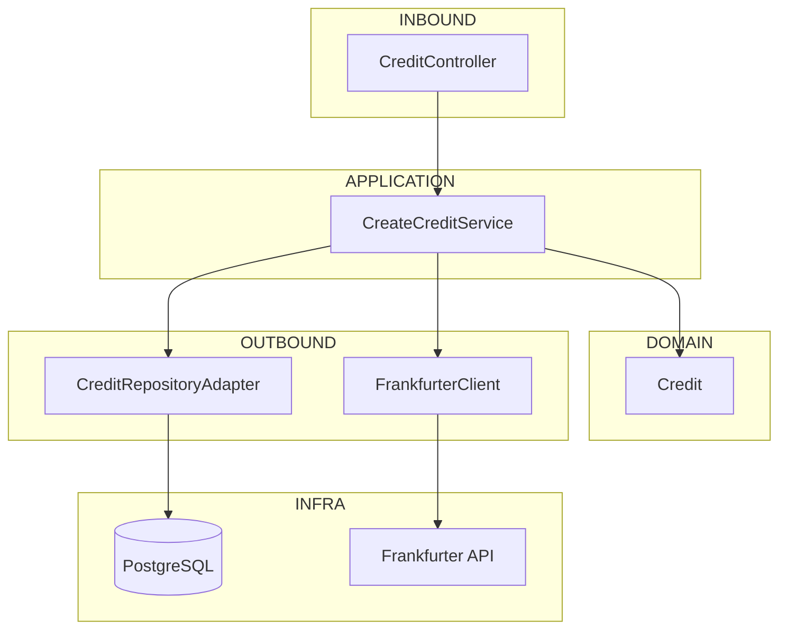

# CreditApplication

###Consideraciones
<p>
Versiones ocupadas para el proyecto:
</p>

- Java 21
- PostgreSQL 16
- Spring boot 3.5.14
- Redis 7

<p>
Ambiente de prueba:
</p>

- Docker Desktop
- Github CodeSpace
- Railway

<p>
Adicionales :
</p>

- Lombok
- MapStruct
- JaCoCo
- Redis
- OpenApi

###Flujo de interaccion
```seq
Customer->CreditApplication: Genera solicitud de credito 
Note right of CreditApplication: Api valida la informacion 
CreditApplication-->Customer: Solicitud creada 
```

