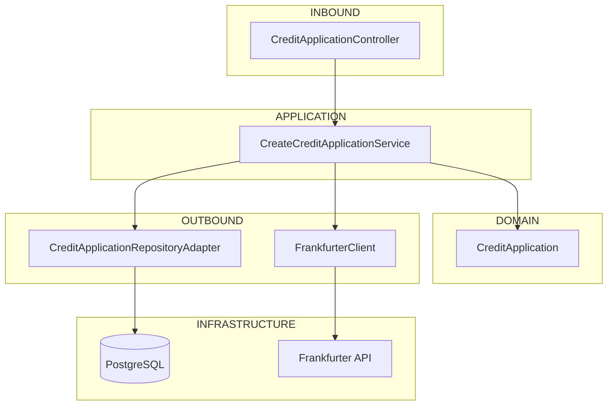

# CreditApplication

## Consideraciones

Versiones ocupadas para el proyecto:

- Java 21
- PostgreSQL 16
- Spring boot 3.5.14
- Redis 7

Ambiente de prueba:

- Docker Desktop
- Github CodeSpace
- Railway

Adicionales :

- Lombok
- MapStruct
- JaCoCo
- Redis
- OpenApi

## Instrucciones para probar
1. Descargar o clonar el repositorio.
   
   `$ git clone {{repo}}`
2. Levantar con el comando.
   
  `$ docker-compose up`
  
3. Utilizar la collecion postman compartida para probar.

## Instrucciones para probar (Opcion 2 - GitHub)
1. Crear repositorio personal.

2. Subir contenido al nuevo repositorio.

3. Desde la raiz del repositorio.
  Code -> Create CodeSpace

## Instrucciones para probar (Opcion 3 - Railway)
1. Crear cuenta railway : https://railway.com/.

2. Crear proyecto.

3. Crear base de datos para PostgreSQL.

4. Crear base de datos para Redis.

5. Respaldar variables de bases de datos para generar las siguientes variables para la app:
  - SPRING_DATASOURCE_URL
  - SPRING_DATASOURCE_USERNAME
  - SPRING_DATASOURCE_PASSWORD
  - SPRING_REDIS_HOST
    
6. Generar proceso por medio de respositorio.

7. Incluir variables en el proceso de spring.

8. Generar url desde el proceso de spring en setting.

9. Usar coleccion postman para probar.

## Flujo de interaccion

## Oportunidades de mejora (Faltantes)
1. Cubrir porcentaje faltante de pruebas unitarias.
2. Paginacion pendiente en el listado de todas las solicitudes
3. Continuar con la normalizacion de la base incluyendo las nuevas tablas
4. RabbitMQ
5. Despliegue Azure
